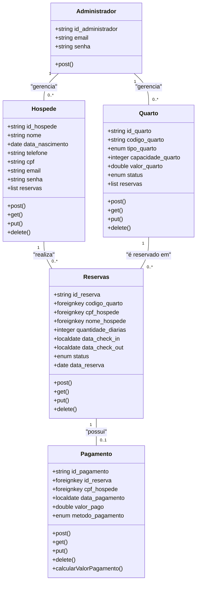
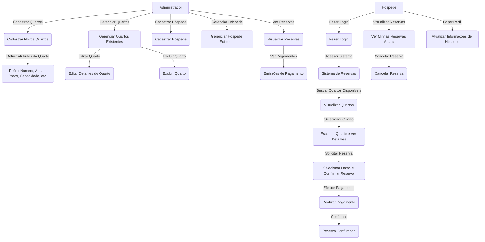
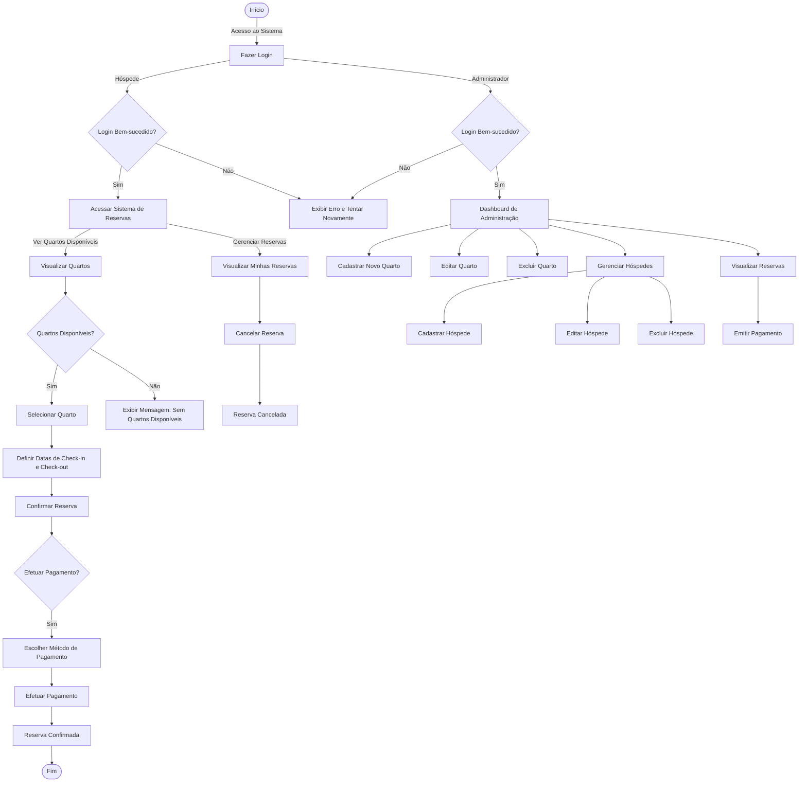

 
 
 

   

   
  
  
  

 
   

</a>

## Documentação da API - Sistema de Controle de Reservas de Hotel

### Visão Geral do Projeto
**Objetivo:**
A API do Sistema de Controle de Reservas de Hotel é responsável por permitir a autenticação de hóspedes, gerenciar reservas e listar quartos disponíveis. O sistema é integrado a uma interface em Java Swing usada por administradores para operações CRUD de hóspedes e quartos. Esta API utiliza Spring Boot e conecta-se ao MongoDB para persistência de dados.

     
</a>

- **Java 17** (ou superior)  
- **Spring Boot**  
  - Spring Web  
  - Spring Data MongoDB  
  - Spring DevTools  
  - Lombok  
  - Thymeleaf  
- **MongoDB**  
- **Maven** para gerenciamento de dependências  
- **Thunder Client** para testes de API  
     

</a>

**Equipe:**
- 1 Gerente de Projetos
- 3 Desenvolvedores Full-Stack (Spring Boot e Java)
- 1 Administrador de Banco de Dados
- 1 Especialista em Segurança

**Tecnologias:**
- **Spring Boot** (API)
- **Java Swing** (Interface)
- **MongoDB** (Banco de Dados)
- **Git/GitHub** (Controle de Versão)

**Ferramentas de Gestão:**
- Trello para gerenciamento de tarefas
- Slack para comunicação interna
- Mermaid para montagem dos diagramas

     

</a>

     

</a>

     

</a>

     

### Acesso ao Sistema

1. **Realizar Cadastro (apenas hóspedes realizam cadastro):**
   - Na tela inicial, clique na opção **"Cadastrar"**.
   - Preencha todos os campos obrigatórios (nome, CPF, telefone, e-mail e senha) e clique em **"Salvar"**.
   - Após o cadastro, você receberá uma confirmação de que seu cadastro foi realizado com sucesso.

2. **Fazer Login:**
   - Após o cadastro, insira seu **e-mail** e **senha** nos campos apropriados.
   - Clique no botão **"Fazer Login"** para acessar o sistema.

### Para Hóspedes

3. **Visualizar Quartos Disponíveis:**
   - Após o login, você será direcionado para o sistema de reservas.
   - Clique na opção **"Ver Quartos Disponíveis"** para listar os quartos que podem ser reservados.

4. **Selecionar Quarto:**
   - Escolha um quarto da lista para visualizar os detalhes (número, capacidade, preço, etc.).
   - Clique em **"Solicitar Reserva"** para iniciar o processo de reserva.

5. **Definir Datas de Check-in e Check-out:**
   - Insira as datas desejadas para check-in e check-out.
   - Clique em **"Confirmar Reserva"**.

6. **Efetuar Pagamento:**
   - Escolha um método de pagamento (cartão de crédito, débito, etc.).
   - Clique em **"Efetuar Pagamento"** para finalizar a reserva.
   - Você verá uma mensagem de **"Reserva Confirmada"** após a conclusão do pagamento.

7. **Visualizar Reservas:**
   - Acesse a opção **"Minhas Reservas"** para ver todas as reservas feitas.
   - Você pode cancelar reservas existentes, se necessário.

8. **Editar Perfil:**
   - Acesse a opção **"Editar Perfil"** para atualizar suas informações pessoais, como telefone e endereço de e-mail.

### Para Administradores

9. **Acessar Dashboard:**
   - Após o login, você será direcionado ao **Dashboard de Administração**.
   - Aqui, você pode gerenciar quartos e hóspedes, além de visualizar reservas.

10. **Cadastrar Novo Quarto:**
    - Clique em **"Cadastrar Novo Quarto"** e preencha os campos necessários (número, andar, preço, capacidade, etc.).
    - Clique em **"Salvar"** para adicionar o quarto ao sistema.

11. **Gerenciar Quartos Existentes:**
    - Acesse a opção **"Gerenciar Quartos"** para visualizar todos os quartos cadastrados.
    - Você pode editar ou excluir quartos clicando nas opções correspondentes ao lado de cada quarto.

12. **Gerenciar Hóspedes:**
    - Clique em **"Gerenciar Hóspedes"** para visualizar e gerenciar os dados dos hóspedes.
    - Você pode cadastrar novos hóspedes, editar informações existentes ou excluir hóspedes.

13. **Visualizar Reservas:**
    - Acesse **"Visualizar Reservas"** para ver todas as reservas feitas por hóspedes.
    - Você pode emitir pagamentos e acessar extratos de emissão fiscal.
     

### - [Pasta de Testes Unitários](https://github.com/epicestudar/Hostly-spring-API/tree/main/hostly_api/src/main/java/com/example/hostly_api/Testes).

